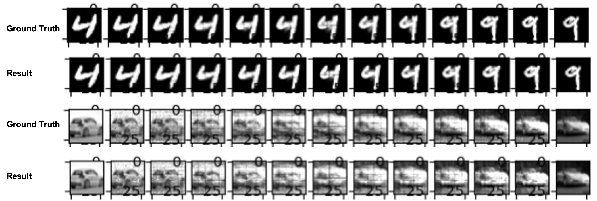

# OT_discrete


This repo is the implementation of Meta OT between discrete measures of the paper [Meta Optimal Transport](https://arxiv.org/abs/2206.05262).

The key function is the loss class dual_obj_loss in Solver\OT_Discrete.py, you can embed it to your only project and ignore other part of this repo.

This project is based on these resources:
1. [facebookresearch/meta-ot](https://github.com/facebookresearch/meta-ot)
2. [ott-jax/ott](https://github.com/ott-jax/ott)

Note: 
1. This repo doesn't implement the continuous measure.
2. This implementation has a slight change comparing with original implementation, i.e., in this code, the predicted potential will be used as initial point then use Sinkhorn iteration on both dual variables to get new potentials instead of directly using the predicted values, check Line 140 of Solver\OT_Discrete.py.

# Installation Dependencies
* torch

if you don't need the ground-trouth result, then comment line 80-101 of Solver\OT_Discrete.py, then following libs are not needed.
* jax 
* ott-jax

# How to Run
```
python main.py
```
Then check the result in the folder - inProc_data
